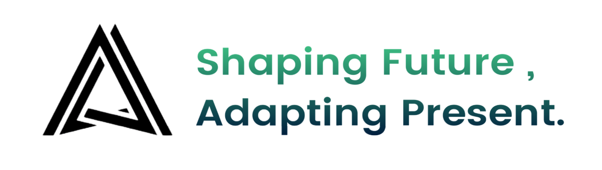
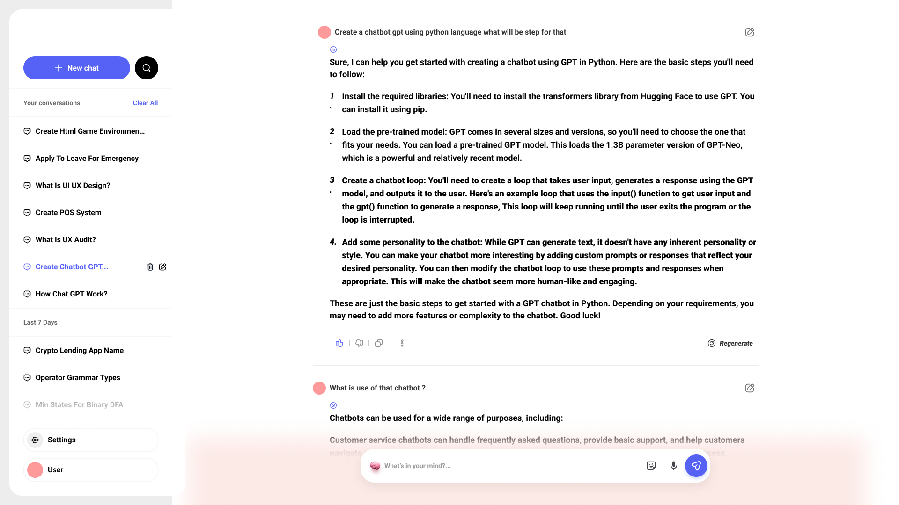

  

  

# 🌐 Adaptive Ally  

**Shaping Futures, Adapting Present**  

---

## 🎨 Overview  
**Adaptive Ally** is a **UI/UX prototype** showcasing an accessible, modern, and adaptive interface.  
The design includes key flows such as **Sign In, Sign Up, Home, and Chat** screens to illustrate a smooth and user-friendly experience.  

---

## ✨ Features (UI Prototype)  

- 📝 **Sign Up Page** – Simple onboarding experience.  
- 🔑 **Sign In Page** – Quick and intuitive login.  
- 🏠 **Home Page** – Central hub for navigation.  
- 💬 **Chat / Prompt Page** – Modern layout for communication.  
- 🎨 **Consistent Visuals** – Minimalist and adaptive UI design.  

---

## 📸 Screenshots  

| Cover | Sign In | Sign Up |  
|-------|---------|---------|  
|  |  |  |  

| Home | Prompt |  
|------|--------|  
|  |  |  

---

⚡ *Adaptive Ally – Designing interfaces that adapt with you.*  
